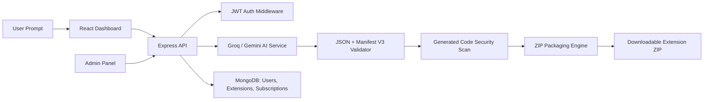

# Extensio.ai - No-Code Chrome Extension Factory


Extensio.ai is an AI-powered platform that enables users with no programming knowledge to create Chrome extensions simply by describing what they want in plain English. The platform generates complete Chrome Extension Manifest V3 files, packages them into a ZIP archive, and provides an instant download.

---

## Introduction

Building Chrome extensions usually requires knowledge of JavaScript, Manifest V3, content scripts, background workers, permissions, packaging, and security rules. Extensio.ai removes that complexity.

Users describe an idea like:

```text
Create a Chrome extension that replaces all website images with red boxes.
```

Extensio.ai generates the required extension files, validates them, stores the project history, packages the result, and gives the user a downloadable ZIP.

---

## Features

- AI-powered Chrome extension generation
- Chrome Manifest V3 support
- Automatic file generation for extension projects
- ZIP packaging and instant download
- JWT authentication
- Password hashing with bcrypt
- MongoDB database integration
- Extension history and project management
- Edit existing extensions through natural-language prompts
- Subscription plans: Free, Pro, Premium
- Admin dashboard for users, extensions, subscriptions, and analytics
- Security protections with Helmet, CORS, rate limiting, input validation, and generated-code scanning
- Responsive React frontend
- Node.js and Express backend
- AI integration using Groq API, with Gemini API support planned

---

## Tech Stack

### Frontend

- React.js
- Tailwind CSS
- Vite
- React Router
- Lucide React

### Backend

- Node.js
- Express.js
- MongoDB
- Mongoose

### Authentication

- JWT
- bcrypt

### AI

- Groq API
- Gemini API support planned

### File Processing and Security

- Archiver
- Helmet
- CORS
- Express Rate Limit
- Express Validator
- sanitize-html

---

## System Architecture



---

## Folder Structure

```text
.
├── backend/
│   ├── server.js
│   ├── package.json
│   ├── .env.example
│   └── server/
│       ├── app.js
│       ├── config/
│       ├── controllers/
│       ├── middleware/
│       ├── models/
│       ├── routes/
│       └── services/
├── frontend/
│   ├── index.html
│   ├── package.json
│   ├── vite.config.js
│   └── src/
│       ├── App.jsx
│       ├── index.css
│       ├── components/
│       ├── pages/
│       └── services/
├── DEPLOYMENT.md
├── package.json
└── README.md
```

---

## Installation Guide

### 1. Clone the repository

```bash
git clone https://github.com/AbhinavM-1/Text-to-Extension-Developer-Platform-.git
cd Text-to-Extension-Developer-Platform-
```

### 2. Install dependencies

```bash
npm run install:all
```

This installs dependencies for both the frontend and backend.

---

## Environment Variables Setup

Create a `.env` file inside the `backend` folder:

```bash
cd backend
cp .env.example .env
```

Update the values:

```env
PORT=3001
CLIENT_ORIGIN=http://localhost:5173
MONGODB_URI=mongodb://127.0.0.1:27017/extensio_ai
JWT_SECRET=replace-with-a-long-random-secret
JWT_EXPIRES_IN=7d

AI_PROVIDER=groq

GROQ_API_KEY=your_groq_api_key
GROQ_MODEL=llama-3.1-8b-instant
GROQ_BASE_URL=https://api.groq.com/openai/v1
```

For MongoDB Atlas, replace `MONGODB_URI` with your Atlas connection string.

---

## Running the Project Locally

From the root directory:

```bash
npm start
```

This starts:

- Frontend: `http://localhost:5173`
- Backend: `http://localhost:3001`

Run only the frontend:

```bash
npm run frontend
```

Run only the backend:

```bash
npm run backend
```

Build the frontend:

```bash
npm run build
```

---

## API Endpoints

### Authentication

| Method | Endpoint | Description |
| --- | --- | --- |
| POST | `/api/auth/register` | Register a new user |
| POST | `/api/auth/login` | Login user |
| POST | `/api/auth/forgot-password` | Request password reset token |
| GET | `/api/auth/me` | Get current authenticated user |

### Extensions

| Method | Endpoint | Description |
| --- | --- | --- |
| GET | `/api/extensions` | List user's generated extensions |
| POST | `/api/extensions/generate` | Generate a new Chrome extension |
| GET | `/api/extensions/:id` | Get extension details |
| POST | `/api/extensions/:id/edit` | Edit an extension through a prompt |
| POST | `/api/extensions/:id/security-scan` | Scan generated files |
| DELETE | `/api/extensions/:id` | Delete an extension |

### Subscriptions

| Method | Endpoint | Description |
| --- | --- | --- |
| GET | `/api/subscriptions/me` | Get current subscription |
| PATCH | `/api/subscriptions/me` | Update subscription plan |

### Admin

| Method | Endpoint | Description |
| --- | --- | --- |
| GET | `/api/admin/analytics` | View analytics |
| GET | `/api/admin/users` | View users |
| GET | `/api/admin/extensions` | View all extensions |
| DELETE | `/api/admin/extensions/:id` | Delete any extension |
| PATCH | `/api/admin/subscriptions/:userId` | Manage user subscription |

### Downloads

| Method | Endpoint | Description |
| --- | --- | --- |
| GET | `/downloads/:zipName` | Download generated extension ZIP |

---

## Screenshots

> Add screenshots of the dashboard, generated files view, authentication pages, and admin panel here.

```text
screenshots/
├── dashboard.png
├── generator.png
├── extension-history.png
├── admin-panel.png
└── auth.png
```

---

## Future Improvements

- Add payment gateway integration for subscriptions
- Add Gemini API provider switching in the dashboard
- Add live extension preview sandbox
- Add Chrome Web Store publishing workflow
- Add team collaboration and shared workspaces
- Add advanced prompt templates
- Add automated generated-extension test runner
- Add cloud ZIP storage using AWS S3 or similar storage
- Add audit logs for admin actions

---

## Security Features

- JWT-protected routes
- bcrypt password hashing
- Helmet security headers
- CORS protection
- Express rate limiting
- Input validation with express-validator
- Input sanitization with sanitize-html
- Generated file validation
- Manifest V3 compliance checks
- Basic malicious-code detection for generated files
- Sensitive environment variables kept out of Git

---

## Deployment Guide

### Frontend

Build the frontend:

```bash
npm run build --prefix frontend
```

Deploy `frontend/dist` to:

- Vercel
- Netlify
- Azure Static Web Apps
- Cloudflare Pages

### Backend

Deploy the backend to:

- Render
- Railway
- Azure App Service
- Fly.io

Production requirements:

- Set all backend environment variables
- Use MongoDB Atlas
- Set `CLIENT_ORIGIN` to the deployed frontend URL
- Keep API keys private
- Use HTTPS

More details are available in [DEPLOYMENT.md](./DEPLOYMENT.md).

---

## Contributing

Contributions are welcome.

1. Fork the repository
2. Create a feature branch

```bash
git checkout -b feature/your-feature-name
```

3. Commit your changes

```bash
git commit -m "feat: add your feature"
```

4. Push to your branch

```bash
git push origin feature/your-feature-name
```

5. Open a pull request

---

## License

This project is licensed under the MIT License.

You can add a `LICENSE` file to the repository for the full license text.

---

## Author

**Abhinav Mandal**

- GitHub: [@AbhinavM-1](https://github.com/AbhinavM-1)
- Project: [Extensio.ai - No-Code Chrome Extension Factory](https://github.com/AbhinavM-1/Text-to-Extension-Developer-Platform-)

---

## Portfolio Note

Extensio.ai demonstrates full-stack AI product engineering, including authentication, database modeling, secure API design, AI integration, code generation, file packaging, and a modern responsive frontend.
